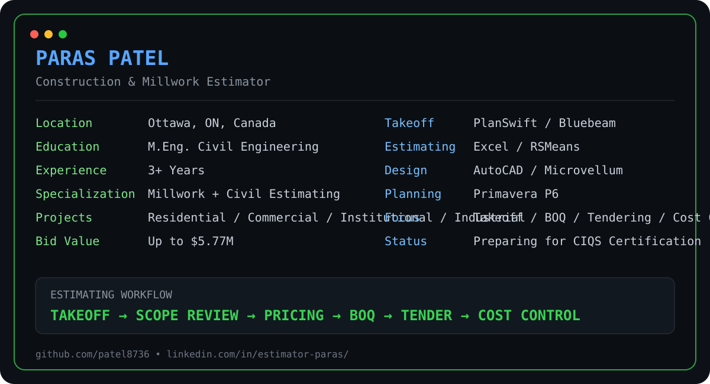

[README.md](https://github.com/user-attachments/files/31696018/README.md)
<div align="center">

# Paras Patel
### Construction & Millwork Estimator | Civil Engineer

📍 Ottawa, Ontario, Canada  
📧 [paras.work.ca@gmail.com](mailto:paras.work.ca@gmail.com)  
💼 [LinkedIn](https://www.linkedin.com/in/estimator-paras/)  
🐙 [GitHub](https://github.com/patel8736)

<p align="center">
  
</p>



</div>

---

## About Me

Construction and Millwork Estimator with **3+ years of experience** preparing detailed estimates, quantity take-offs, Bills of Quantities, tender submissions, and cost forecasts for architectural millwork, residential, commercial, institutional, and industrial construction projects.

My work combines **technical drawing review, quantity surveying, supplier/subcontractor pricing, bid preparation, cost control, and Excel-based estimating tools**.

- 🎓 M.Eng. in Civil Engineering — University of Ottawa
- 🏗️ Experience across civil, structural, architectural millwork, commercial, institutional, residential, and industrial projects
- 💰 Supported successful bids and project closures valued up to **$5.77M**
- 📊 Contributed to an approximate **56% project closing rate**
- 📐 Worked on **30+ industrial, commercial, and institutional projects**
- 🧮 Developed Excel tools that improved estimating efficiency by approximately **40%**
- 🎯 Currently preparing for the **CIQS Construction Estimator Certified** designation

---

## Estimating Expertise

### Estimating & Quantity Surveying
`Quantity Take-offs` • `Bills of Quantities` • `Cost Estimation` • `Bid Preparation` • `Rate Analysis` • `Cost Forecasting` • `Change Orders` • `Scope Review` • `Value Engineering` • `Tender Documentation`

### Architectural Millwork
`Custom Cabinetry` • `Kitchens` • `Vanities` • `Reception Areas` • `Wall Panelling` • `Banquettes` • `Ceiling Features` • `Architectural Woodwork` • `Hardware Pricing` • `Installation Pricing`

### Civil / Construction Estimating
`Reinforced Concrete` • `Structural Steel` • `Composite Structures` • `Finishing Work` • `Labour` • `Equipment` • `Supplier Comparison` • `Subcontractor Comparison` • `Procurement Support`

---

## Software & Tools


---

## Professional Impact

| Area | Result |
|---|---|
| Largest supported bid / project closure | **Up to $5.77M** |
| Project closing contribution | **~56%** |
| Civil / structural projects estimated | **30+** |
| Excel estimating efficiency improvement | **~40%** |
| Manual error reduction | **~25%** |
| Change orders maintained | **Below ~5%** |

---

## Experience

### Old Salt Millwork — Estimator
**Vars, Ontario | May 2025 – Present**

- Estimate custom architectural millwork for residential, commercial, and institutional projects.
- Perform quantity take-offs using architectural drawings, elevations, reflected ceiling plans, specifications, details, and schedules.
- Price melamine, TFL, HPL, MDF, plywood, white oak, red oak, hardware, finishing, delivery, and installation.
- Review addenda, RFIs, tender revisions, scope changes, and design updates.
- Prepare bid forms, tender documentation, inclusions, exclusions, clarifications, and quotation revisions.
- Coordinate with suppliers, vendors, subcontractors, and project managers.
- Developed an Excel-based sheet nesting and material optimization tool to improve sheet-count accuracy and quotation turnaround.
- Prepare Microvellum shop drawings when required.

### Sanrachna Consultancy — Estimator
**Surat, Gujarat, India | Nov 2021 – Nov 2022**

- Completed estimating and quantity surveying work for **30+ industrial, commercial, and institutional projects**.
- Prepared BOQs, quantity take-offs, rate analyses, tender documentation, cost forecasts, and project estimates.
- Estimated reinforced concrete, structural steel, composite structures, finishing work, labour, and equipment.
- Evaluated supplier and subcontractor quotations.
- Developed a reusable Excel estimating template that improved efficiency by approximately **40%** and reduced manual errors by approximately **25%**.
- Maintained change orders below approximately **5%** through improved take-off accuracy and scope review.

### Sanrachna Consultancy — Estimating Intern
**Surat, Gujarat, India | Apr 2021 – Oct 2021**

- Assisted with quantity take-offs, estimates, tender documentation, technical reports, and project records.
- Prepared and reviewed detailed engineering drawings.
- Supported engineering teams with cost estimation and technical documentation.

---

## Selected Estimating Experience

### Architectural Millwork & Custom Cabinetry
- Kitchens
- Vanities
- Reception areas
- Wall panelling
- Banquettes
- Ceiling slats
- Custom cabinetry
- Architectural woodwork
- Material, hardware, labour, finishing, delivery, and installation pricing

### Industrial, Commercial & Institutional Construction
- Reinforced concrete
- Structural steel
- Composite structures
- Bills of Quantities
- Rate analysis
- Supplier and subcontractor comparison
- Procurement support
- Budgeting and cost control

### Excel Estimating & Material Optimization
- Quantity calculation tools
- Sheet nesting
- Material optimization
- Cost analysis
- Estimate preparation
- Reusable estimating templates
- Reduction of repetitive manual calculations

---

## Education

**University of Ottawa**  
Master of Engineering in Civil Engineering  
Ottawa, Ontario | Jan 2023 – Jun 2024

**Gujarat Technological University**  
Bachelor of Engineering in Civil Engineering  
Gujarat, India | Aug 2017 – Aug 2021

---

## Standards & Technical Knowledge

`NBC` • `OBC` • `CSI Divisions` • `ANSI` • `BHMA` • `IS 1200` • `Applicable Indian Standards`

---

## Future Portfolio Repositories

I plan to add practical estimating resources and tools here over time:

- Construction Estimating Templates
- Quantity Takeoff Tools
- Excel Estimating Tools
- Millwork Material Calculator
- Sheet Nesting & Optimization
- BOQ Templates
- Cost Analysis Tools

> These are planned portfolio sections and are not listed as completed repositories yet.

---

## Profile Photo

When ready, upload your photo as:

`assets/profile-photo.png`

Then add this line near the top of the README:

```html

```

---

## Let’s Connect

I’m open to opportunities related to **Construction Estimating, Millwork Estimating, Quantity Takeoffs, Pre-Construction, Cost Planning, and Civil Estimating**.

[](https://www.linkedin.com/in/estimator-paras/)
[](mailto:paras.work.ca@gmail.com)
[](https://github.com/patel8736)

